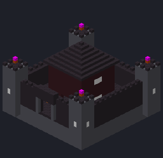
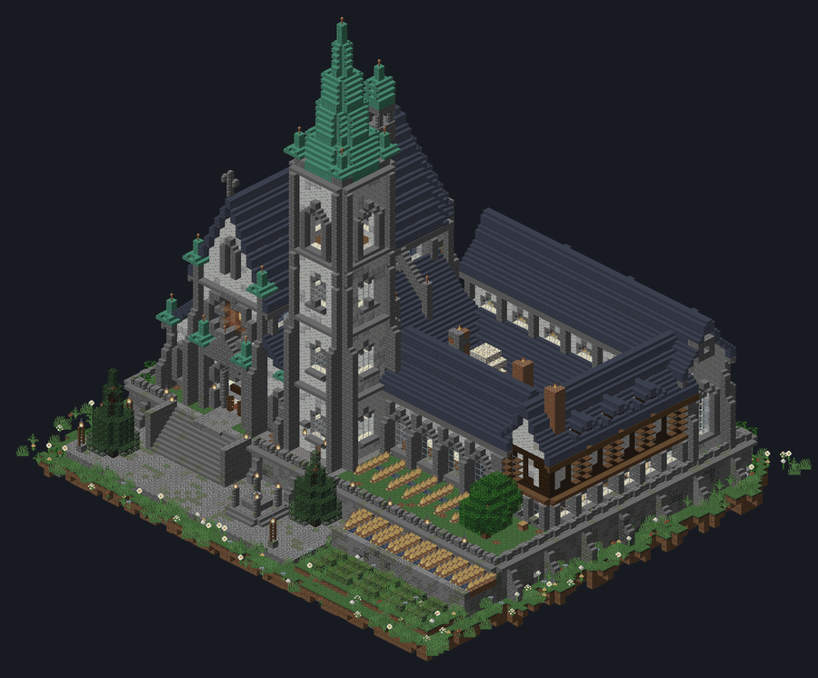
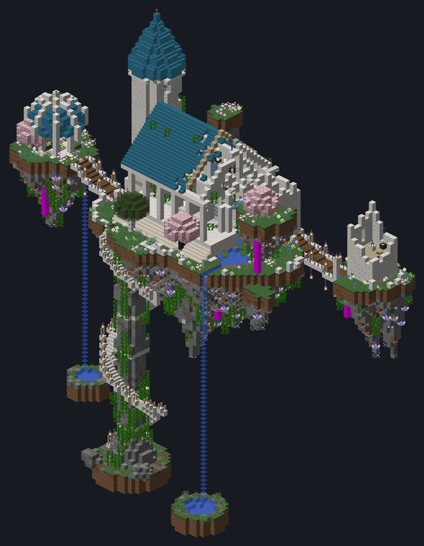
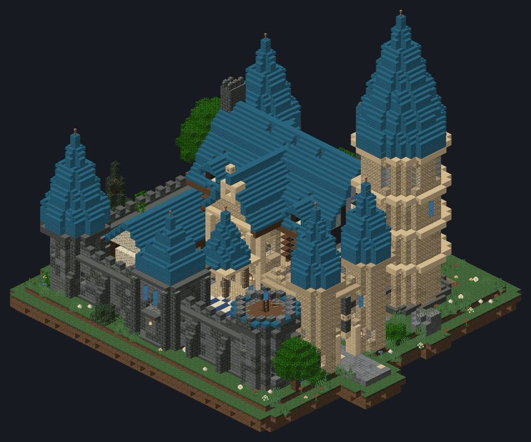
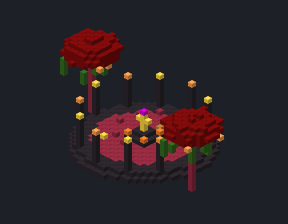
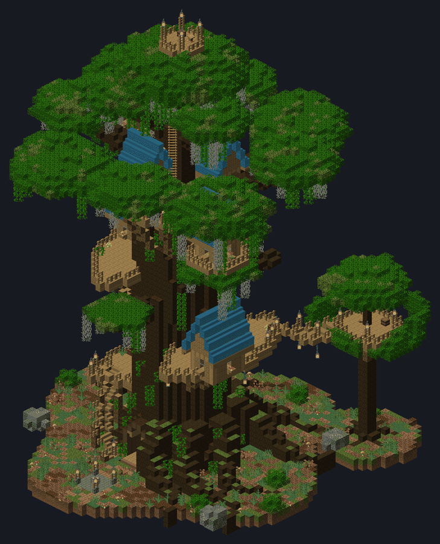
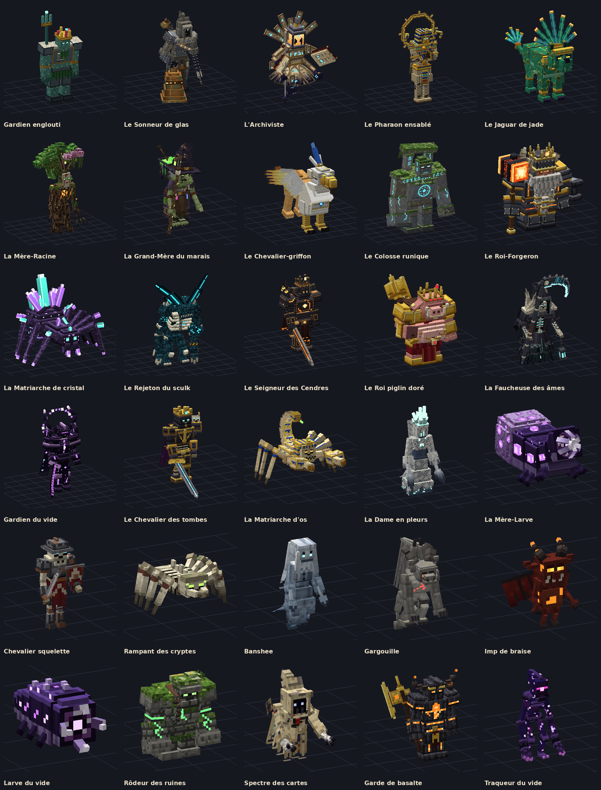

# Wayfarers — mod d'exploration coop pour Minecraft 26.2 (Forge 65.1.0)

**Wayfarers** transforme une survie entre potes en grande expédition. On y trouve :

- **35 structures** construites à la main, réparties dans toutes les dimensions, dont **4 donjons souterrains** générés en plusieurs plans ;
- **une quête en 5 chapitres partagée par tout le serveur**, qui fait découvrir le monde étape par étape ;
- des **outils de confort** pour passer moins de temps à ranger et plus de temps à explorer : pierres de voyage, coffre de tri, terminal de guilde, tombes, sac à dos, aimant ;
- **8 armes à capacité**, **16 armes de boss**, **2 outils de zone**, **3 ensembles d'armure** ;
- **10 créatures** et **20 boss façon Elden Ring** (16 grands boss et 4 champions de donjon), tous avec un vrai modèle 3D animé ;
- **15 blocs de construction exclusifs** (briques de la Guilde, tuiles de toit, lampes runiques, briques de braise, briques du vide…), utilisés dans les structures et fabricables ;
- **une vraie difficulté** : plus on s'éloigne du spawn, plus les monstres sont forts, avec des monstres d'élite et des lunes de sang ;
- **un nouveau monde** (désactivable) : relief plus haut et plus déchiqueté, méga-cavernes et **41 biomes** propres au mod ;
- **un univers steampunk** : laiton, zinc, mithril, éther, 13 blocs de déco, 9 meubles en 3D, 9 machines simples et la **Citadelle d'horlogerie** ;
- **des talents RPG et de la magie simple** : arbre de 36 talents (touche **K**), capacité active (touche **V**), mana et 7 bâtons de sort ;
- **une carte du monde et une mini-carte** (touche **M**) partagées sur un serveur, avec repères, signaux et pierres de voyage ;
- **de vraies interfaces** : journal de quêtes, écran de voyage, terminal de stockage, manuel illustré, barres de vie des monstres.

| Cible | Version |
|---|---|
| Minecraft | **26.2** |
| Forge | **65.1.0** (MDK `forge-26.2-65.1.0-mdk.zip`) |
| Java | **25** |

---

## Télécharger

**[⬇ wayfarers-1.0.0.jar (dernier build)](https://github.com/jules-crevoisier/mode-minecraft/releases/download/dev-ccr-127dc262-tsdn10/wayfarers-1.0.0.jar)**

GitHub recompile le mod à chaque modification : voir l'onglet *Releases* ou *Actions* du dépôt.

## Installation (CurseForge)

1. Dans CurseForge, crée un profil **Minecraft 26.2** avec **Forge 65.1.0**.
2. Compile le mod (voir plus bas) ou récupère le fichier `wayfarers-1.0.0.jar`.
3. Ouvre le dossier du profil (`…` → *Open Folder*) et dépose `wayfarers-1.0.0.jar` dans `mods/`.
4. Le mod est autonome : aucune autre bibliothèque n'est nécessaire.

**En multijoueur**, le même `.jar` doit être installé **sur le serveur et chez chaque joueur**.

**Les structures n'apparaissent que dans les régions jamais générées.** Le plus simple est de créer un nouveau monde.

## Compiler le `.jar`

```bash
./gradlew build          # nécessite un JDK 25 (Gradle peut le télécharger tout seul)
# → build/libs/wayfarers-1.0.0.jar
./gradlew runClient      # lancer le jeu en développement
./gradlew runServer      # serveur de test
```

---


## Nouveautés de la grande mise à jour

### Interfaces et aide en jeu
| Quoi | Comment |
|---|---|
| **Manuel du Voyageur** | Donné à la première connexion : une page par système, avec sommaire. Survole un objet du mod et **maintiens W** pour ouvrir sa page. Des cartes d'astuce s'affichent la première fois qu'on rencontre un système. |
| **Journal de quêtes** (touche **J** ou l'Atlas) | Chapitres, étapes, récompenses ; bouton « Suivre » qui affiche l'objectif à l'écran. |
| **Écran de voyage** | Clic droit sur une pierre : liste avec recherche, favoris et renommage. On ne voyage que depuis une pierre. |
| **Mini-carte** | Hublot de laiton dans un coin : terrain, direction, coordonnées, biome, pierres de voyage, repères, joueurs, signaux, tombes et dernière mort. Touche **H** pour la masquer, **Z** pour le zoom ; coin, taille, forme (ronde ou carrée) et rotation dans `wayfarers-client.toml`. Sous terre, elle montre la grotte où l'on se trouve. |
| **Carte du monde** (touche **M**, ou l'Atlas accroupi) | Glisser pour déplacer, molette pour zoomer, Espace pour revenir sur soi ; légende cliquable (masquer un type), liste des repères. Clic droit : poser un repère (nom, couleur, icône, **privé ou partagé** avec tous) ; clic molette ou touche **B** : un **signal** que tous voient une minute. |
| **Exploration partagée** | Le serveur dessine la carte à partir des chunks chargés autour des joueurs et l'envoie aux clients par morceaux compressés : sur un serveur, chacun voit ce que les autres ont exploré (option `map.sharedExploration` pour une carte par joueur). |
| **Barres de vie** | Au-dessus des monstres blessés, avec les dégâts infligés ; étoile pour les élites. Réglable dans la config client. |

### Rangement, construction et fermes
| Quoi | Comment |
|---|---|
| **Boutons dans tous les coffres** | Trier, Tout prendre, Déposer les identiques, Ranger dans les coffres proches ; barre de recherche ; clic molette pour trier. |
| **Confort** | Réapprovisionnement automatique de la barre d'action ; récolte au clic droit avec replantation. |
| **Terminal de guilde** | Tous les coffres de la base (48 blocs autour, plus loin avec des **relais de stockage** qui s'enchaînent) dans une seule grille : recherche, tri, coffres exclus au choix, « Montrer » encadre les coffres reliés. |
| **Caisse compacte** | 32 piles d'un seul objet, affiché en façade avec le total. Clic droit pour ranger (double clic : tout), clic gauche pour prendre. |
| **Baguettes du bâtisseur** | Prolongent une face (16 ou 64 blocs) avec un aperçu ; accroupi dans le vide pour annuler. **Symétrie** : accroupi + clic sur un bloc pour placer le centre du miroir, touche **G** pour choisir miroir X, Z ou les deux (4 côtés) ; les copies en miroir s'affichent en bleu. |
| **Burin du graveur** | Clic droit : le bloc passe à la variante suivante de sa famille (pierre → briques → moussues → fissurées → sculptées...), accroupi pour revenir. Escaliers et dalles gardent leur forme, le cuivre son oxydation. Pierre, ardoise, tuf, grès, quartz, prismarine, pierre noire, terre cuite, cuivre et blocs du mod (familles en données : `data/<ns>/chisel/*.json`). |
| **Table de taille** | Pose une pile, clique une variante : toute la pile est transformée, gratuitement. |
| **Machines simples** (sans énergie ni câble) | Moissonneuse, arroseur, trémie aspirante, casseur et poseur de blocs, minuteur, émetteur et récepteur sans fil, détecteur de créatures. |

### Talents et magie
Points gagnés par quête, par boss et tous les 10 niveaux. Arbre de **4 branches** (Guerrier, Explorateur, Arcaniste, Mécaniste) sur la touche **K**, avec une capacité active par branche sur la touche **V**. Les bâtons (feu, givre, foudre, soin, lévitation, bouclier, vapeur) consomment du mana. Anneau et amulette augmentent le mana ; la Fiole d'oubli rend tous les points.

### Steampunk : métaux, armures, blocs et meubles
- **Minerais** : zinc (3 cuivre + 1 zinc → 4 laiton), mithril (profondeurs), cristal d'éther, orichalque (Nether).
- **Ensembles d'armure** : Laiton (vision nocturne, minage rapide), Mithril (+4 PV, vitesse), Éther (+75 mana, aucune chute), Arcaniste (+100 mana, sorts +25 %).
- **Blocs** : placages de laiton, de cuivre, de vert-de-gris et de fer sombre ; panneaux d'horlogerie et à manomètre ; tuyaux ; lampes Edison ; conduits d'éther ; lambris d'acajou ; capitonnage ; briques de cheminée.
- **Meubles 3D** : table, chaise, étagère, lustre, lampe suspendue, tuyau, garde-corps, engrenage mural, vanne.
- **Armes en 3D en main** pour les armes de boss, les bâtons et les armes spéciales.
- **Gadgets à vapeur** (manuel, catégorie « Gadgets à vapeur ») :
  - **Clé à molette en laiton** : tourne les blocs (escaliers, bûches, coffres, machines…) ; accroupi, règle les machines du mod ou ramasse ses blocs déco et meubles.
  - **Grappin** : griffe lancée à 32 blocs qui te tire jusqu'à elle, sans dégâts de chute.
  - **Planeur en laiton** : tenu en main pendant une chute, il ralentit la descente et fait planer là où on regarde.
  - **Pistolet à rivets** : tire des rivets (ou des pépites de fer), 5 dégâts.
  - **Montre à gousset** : aiguille qui suit le soleil ; clic droit : heure, jour, lune et biome.
  - **Boussole de dirigeable** : son aiguille d'éther pointe vers le Port céleste le plus proche.

### Nouveau monde (option `world.overhaul`)
Le pack intégré **wayfarers:world_overhaul** remplace l'Overworld des **nouveaux** mondes :
- montagnes ~65 % plus hautes, pics jusque vers y 300 ;
- méga-cavernes entre y -40 et 10 ;
- **41 biomes** : forêt enchantée, sylve géante, vallée des cerisiers, toundra aurorale, glacier brisé, pics majestueux, terres rouillées, vallée des engrenages, canyon peint, mer de dunes, marais luminescent, cavernes de cristal, jungle souterraine, grottes thermales, abîme…
- **ses propres bois et pierres** : le **bois-lueur** (troncs pâles, feuilles turquoise qui luisent la nuit ; forêt enchantée, bois de cristal) et le **bois rouillé** (écorce rouge sombre, feuilles rouille ; terres rouillées, vallée des engrenages, savane cendrée), chacun avec bûches, planches, escaliers, dalles, barrières, portillons, portes, trappes, boutons, plaques de pression, feuilles et pousses ; le **marbre** en strates dans les falaises des montagnes, la **roche rouillée** des terres rouillées et l'**ardoise bleue** de la mer d'ardoise et des hautes terres de pins, avec leurs formes polies, briques, pilier, carreaux, escaliers, dalles et murets. Tous se fabriquent aussi dans un monde vanilla (voir le manuel, pages « Bois du nouveau monde » et « Pierres du nouveau monde »).

Villages, forteresses et structures du mod y apparaissent comme avant.

Pour garder le monde vanilla : mettre `world.overhaul = false` dans `config/wayfarers-common.toml`, ou décocher le pack dans l'écran « Packs de données » à la création du monde. Comme Terralith, Minecraft affiche un avertissement « expérimental » à la création du monde : c'est normal.

### Méga-structures
**Citadelle d'horlogerie** (71×71 blocs) : tour-horloge de 75 blocs avec quatre cadrans, beffroi et flèche de cuivre oxydé ; sept étages meublés ; quatre ateliers ; quatre cheminées fumantes ; fontaines. On la trouve dans les badlands, savanes, déserts et plaines.

---

## Le contenu

### Les structures (35)

Ce sont des constructions monumentales : 50 à 100 blocs de large, avec des tours qui montent jusqu'à 70 blocs et des intérieurs meublés. Les aperçus isométriques de chaque structure sont dans [`docs/structures/`](docs/structures).

| | | |
|---|---|---|
|  |  |  |
| Forteresse de basalte | Monastère des cimes | Île céleste |
|  |  |  |
| Avant-poste de la Guilde | Sanctuaire piglin | Arbre-monde |

| Dimension | Structures |
|---|---|
| **Surface** | **Avant-poste de la Guilde** : 3 variantes, rempart, châtelet, grande salle, tour des cartes de 46 blocs, pierre de voyage. · **Tour de guet** : une version en ruine, dont le sommet s'est effondré, et une version intacte avec flèche ; cave secrète. · **Monastère des cimes** : église gothique à arcs-boutants, clocher de 46 blocs, cloître, bibliothèque, crypte secrète. · **Oasis du désert** : caravansérail à coupoles et minarets, bazar, colosse de pharaon à moitié enseveli, tombeau caché (archéologie). · **Temple englouti** : sanctuaire à coupole, obélisques, conduit actif, caveau secret. · **Huttes des sorcières** : maisons tordues sur pilotis, tour au toit en chapeau de sorcière, cercle rituel. · **Arbre-monde** : tronc creux de 15 blocs, 3 terrasses à cabanes, ponts de corde, nid de vigie. · **Île céleste** : temple de quartz à 40 blocs du sol, îlots reliés par des ponts, cascades, escalier en spirale. · **Bibliothèque oubliée** : nef gothique, tours jumelles, rotonde effondrée, cabinet secret. · **Mine naine** : chevalement de 20 blocs, village à flanc de colline, 4 galeries, salle forte scellée. · **Campement de bandits** : palissade, tours de guet, tente du chef. · **Phare côtier** : phare de 52 blocs sur un cap, quai, grotte marine. · **Ziggourat de la jungle** : 8 gradins, têtes de serpent à plumes, jeu de balle, tombeau secret. · **Observatoire polaire** : dôme de neige, télescope de cuivre, laboratoire en sous-sol. · **Cercle runique** : trilithes de 13 blocs, crypte sous l'autel. · **Épave de galion** : 3 ponts, château arrière, mât brisé au fond de l'eau. |
| **Souterrain** | **Forge naine** : salle de 63×31 blocs à piliers de lithite, statues de rois nains de 25 blocs, chutes de lave, chambre forte. · **Grotte de cristal** : géode géante avec gouffre, flèches de cristal, atelier de taille, ponts. · **Laboratoire scellé** : sas, salle de contrôle en dôme, 8 cellules de confinement, dont une brèche de sculk. |
| **Grande structure** | **Citadelle engloutie** : cathédrale gothique de prismarine au fond de l'océan. Elle comprend une tour de 76 blocs qui sort de l'eau, une nef et 6 salles à thème reliées par des tunnels de verre, une arène du boss sous un dôme de 40 blocs, et une salle du trésor scellée. Elle existe en 3 variantes. |
| **Nether** | **Forteresse de basalte** : citadelle noire de 89 blocs, douves de lave, tours de 48 blocs, pont-levis, donjon. · **Pont de chaînes** : tablier de 60 blocs suspendu à des maillons géants entre deux tours-portes. · **Sanctuaire piglin** : ziggourat surmontée d'une idole d'or de 34 blocs. · **Fonderie de lave** : usine sur pilotis, cheminées, creusets, grue. · **Tour des âmes** : tour de 72 blocs enlacée de contreforts d'os. · **Marché piglin** : bazar fortifié, auvents rayés, tour centrale, marchands piglins. |
| **End** (îles extérieures) | Observatoire du vide · Jardin flottant de chorus · Archive de l'End · Épave du vide · Nid du Gardien du vide |

Chaque structure a :
- ses propres tables de butin ;
- un générateur de monstres ou une rencontre ;
- souvent un secret.

Plusieurs structures contiennent une **pierre de voyage**.

### La quête : l'Atlas du Voyageur (5 chapitres, 82 étapes)

La quête est un onglet de progrès (touche **L**). Clic droit avec l'**Atlas** pour voir le résumé de la guilde.

1. **Premiers pas** : trouver un avant-poste de la Guilde, récupérer des fragments de carte, fabriquer pierre de voyage, coffre de tri, sac et lame.
2. **Explorateur de la Surface** : découvrir chaque structure de la Surface.
3. **Les profondeurs** : trouver la lithite, les structures souterraines, la Citadelle, et **vaincre le Gardien englouti**.
4. **Le Nether** : les 6 structures, les braises anciennes, l'armure de braise.
5. **L'End** : les éclats du vide, le **Gardien du vide**, et le défi final *Légende des Voyageurs* (toutes les structures).

**La progression est commune** : chaque étape franchie par un joueur est accordée à tout le monde, y compris aux joueurs hors ligne quand ils se reconnectent.

**Chaque palier d'équipement demande le matériau de sa dimension**, ce qui oblige à explorer dans l'ordre :

| Palier | Matériau | Dimension |
|---|---|---|
| 1 | Fragment de carte | Surface |
| 2 | Lithite | Sous terre (minerai sous y=8, ou butin) |
| 3 | Braise ancienne | Nether |
| 4 | Éclat du vide | End |

### Confort et coop

| Objet / bloc | Effet |
|---|---|
| **Pierre de voyage** | Clic droit : écran de voyage vers toutes les pierres découvertes, dans toutes les dimensions (recherche, favoris, renommage). Une pierre découverte l'est **pour tout le monde**. |
| **Coffre de tri** | 54 emplacements. Il aspire les objets au sol dans un rayon de 6 blocs et se trie tout seul quand personne ne regarde dedans. |
| **Terminal de guilde** | Clic droit : tous les coffres de la base (48 blocs autour) dans une seule grille avec recherche. Accroupi : trie tous les coffres. |
| **Relais de stockage** | Étend le terminal : relie les coffres à 32 blocs autour de lui ; à poser à portée du terminal ou d'un autre relais. |
| **Tombe** | À la mort, tes objets sont rangés dans une tombe, et ses coordonnées s'affichent dans le chat. N'importe quel membre du groupe peut les récupérer. |
| **Sac du Voyageur** | 27 emplacements qui voyagent avec toi. |
| **Anneau aimanté** | Attire objets et expérience. Se bascule au clic droit ou avec la touche **N**. |
| **Boussole des structures** | Indique la structure la plus proche (distance + direction). Accroupi : choisir le type de structure. |
| **Parchemin de rappel** | Téléporte à la pierre de voyage la plus proche. |
| **Touche R** | Trie l'inventaire principal (la barre d'action n'est pas touchée). |

### Armes et outils

| Arme / outil | Capacité |
|---|---|
| Lame du Cartographe | Ruée vers l'avant. |
| Marteau tellurique | Onde de choc. |
| Lame de givre | Ralentit ; gèle au 3e coup. |
| Boomerang | Revient à son lanceur. |
| Bâton de l'aube | Repousse les monstres et soigne les alliés. |
| Faux de braise | Met le feu, et soigne dans le Nether. |
| Bâton des tempêtes | Appelle la foudre. |
| Lance du vide | Téléportation dans le dos de la cible. |
| Pioche d'excavation | Mine en 3x3. |
| Hache de bûcheron | Abat l'arbre entier. |

Pour la pioche et la hache, s'accroupir désactive l'effet de zone.

### Armures (bonus d'ensemble complet)

| Ensemble | Bonus |
|---|---|
| **Explorateur** | Vitesse, aucun dégât de chute sous 8 blocs, vision nocturne sous terre. |
| **Braise** | Immunité au feu, rapide dans la lave. |
| **Vide** | Chute lente ; le vide de l'End te ramène au lieu de te tuer. |

### Les boss, façon Elden Ring



Chaque grande structure cache un boss **au fond d'une descente** : un ou deux niveaux de catacombes, d'ossuaires, de cryptes ou de galeries, avec des pièges, des générateurs de monstres et des coffres. Le joueur traverse ensuite une **brume**, et le combat commence.

- **Avant la brume** : un **lieu de grâce**, avec une pierre de voyage pour revenir après une mort.
- **La brume** : on la traverse librement. Pendant le combat elle se solidifie, et elle disparaît quand le boss tombe.
- **La barre de vie** : longue et fine en bas de l'écran, avec une traînée jaune pour les dégâts récents et le compteur de dégâts infligés. La musique de combat se lance.
- **Des attaques télégraphiées** : chaque coup a une préparation lisible (animation et marque au sol), puis une fenêtre pour riposter. Il faut apprendre les schémas, esquiver les ondes en sautant et punir les ouvertures.
- **La deuxième phase** : à mi-vie, le boss rugit (il est alors invulnérable) puis change de rythme, avec de nouvelles attaques et des combos.
- **La posture** : frapper fort et souvent fait chanceler le boss, qui subit alors +50 % de dégâts.
- **Si tout le monde meurt ou s'enfuit** : le boss revient à pleine vie et la brume se rouvre.
- **À sa mort** : « **ENNEMI ABATTU** » s'affiche en or, la salle du trésor s'ouvre et le boss lâche son **Souvenir**.
- **En coop** : la vie du boss augmente de 60 % par joueur supplémentaire.

| Boss | Repaire | Arme forgée avec son Souvenir |
|---|---|---|
| Le Sonneur de glas | Monastère des cimes, chambre de la cloche | Marteau-cloche |
| L'Archiviste | Bibliothèque oubliée, archives interdites | Grimoire interdit |
| Le Pharaon ensablé | Oasis, salle funéraire du tombeau | Fléau du pharaon |
| Le Jaguar de jade | Ziggourat, cénote sacré | Croc de jade |
| La Mère-Racine | Arbre-monde, caverne des racines | Bâton de la Mère-Racine |
| La Grand-Mère du marais | Huttes des sorcières, grotte inondée | Louche de la sorcière |
| Le Chevalier-griffon | Île céleste, esplanade du temple (combat aérien) | Lance du griffon |
| Le Colosse runique | Cercle runique, voûte des runes | Poing runique |
| Le Roi-Forgeron | Forge naine, creuset du roi | Marteau du Roi-Forgeron |
| La Matriarche de cristal | Grotte de cristal, nid de la géode profonde | Croc de cristal |
| Le Rejeton du sculk | Laboratoire scellé, cœur de confinement | Corne du sculk |
| Gardien englouti | Citadelle engloutie, arène sous le dôme | Trident du roi noyé |
| Le Seigneur des Cendres | Forteresse de basalte, trône des cendres | Espadon des Cendres |
| Le Roi piglin doré | Sanctuaire piglin, trésor du roi | Masse dorée |
| La Faucheuse des âmes | Tour des âmes, sommet | Faux des âmes |
| Gardien du vide (boss final) | Nid du vide | Grande lame du vide |

**L'arme de boss** se fabrique avec le Souvenir, 4 matériaux de palier et 2 diamants. Elle a une capacité au clic droit : onde de choc, rayon, ruée, éruptions, racines, nuage de poison, bond, balayage enflammé ou téléportation.

### Les donjons souterrains

Quatre donjons ont une petite entrée en surface (mausolée, temple ensablé, tête de puits, cercle d'obélisques). Elle mène à **2 ou 3 niveaux** de couloirs et de salles tirés au hasard : chaque donjon existe en 3 plans différents. On y trouve des ossuaires, des cryptes, des pièges à flèches, une salle secrète derrière des briques fissurées, et un champion au fond.

| Donjon | Où | Champion |
|---|---|---|
| Catacombes oubliées | Plaines et forêts | Le Chevalier des tombes |
| Hypogée des sables | Désert, badlands | La Matriarche d'os |
| Puits de lithite | Montagnes | La Dame en pleurs |
| Crypte du vide | Îles de l'End | La Mère-Larve |

### Créatures

| Créature | Où on la trouve | Particularité |
|---|---|---|
| Rôdeur des ruines | Ruines de la Surface | Golem de pierre moussue ; ses coups affaiblissent. |
| Spectre des cartes | Bibliothèques | Fantôme de parchemin ; aveugle, brûle au soleil. |
| Garde de basalte | Forteresses du Nether | Hache dorée ; un coup sur trois balaie large. |
| Traqueur du vide | End | Se téléporte près de sa proie. |
| Chevalier squelette | Catacombes | Bouclier qui bloque 80 % des coups de face ; charge au bouclier. |
| Rampant des cryptes | Catacombes, hypogée | Araignée d'os qui grimpe aux murs et bondit. |
| Banshee | Puits de lithite | Vole ; son cri ralentit et repousse. |
| Gargouille | Puits de lithite | Se fige en statue quand on la regarde, attaque quand on tourne le dos. |
| Imp de braise | Nether | Lance des boules de feu, fuit et revient. |
| Larve du vide | Crypte du vide | S'enfouit et ressort sous tes pieds ; libère des endermites en mourant. |

Le chapitre **« Légendes »** de la quête demande de vaincre chaque boss. Le défi final, **Fléau des Légendes**, demande de les vaincre tous.

### Difficulté : le monde devient dangereux

Le **niveau de danger** dépend de l'endroit où un monstre apparaît. Il s'affiche dans la barre d'action quand il change.

| Source | Effet sur le niveau |
|---|---|
| Distance au spawn | +1 tous les 900 blocs |
| Nether | Les distances comptent ×8, et +2 |
| End | +3 |
| Sous y = 0 | +1 |
| Lune de sang | +2 |

- **Effet par niveau** : +15 % de vie et +12 % de dégâts pour chaque monstre. Le niveau est plafonné à 7, « Légendaire ».
- **Monstres d'élite** :
  - Leur nom est doré. Ils ont +100 % de vie, +50 % de dégâts, plus de vitesse et résistent au recul.
  - Leur chance d'apparition est de 3 % de base, plus 2 % par niveau de danger.
  - Ils lâchent le matériau de la dimension, des émeraudes, de l'expérience et parfois un parchemin de rappel.
- **Lune de sang** :
  - Elle arrive toutes les 7 nuits dans la Surface.
  - Le danger augmente et les élites sont 3 fois plus fréquents. Mieux vaut avoir une base solide.
- **Monstres dans les structures** : les grandes structures continuent de faire apparaître leurs gardiens dans le noir, comme les forteresses vanilla. Les générateurs fonctionnent même dans les pièces éclairées.
- **Boss** : leur vie augmente de 60 % par joueur supplémentaire présent dans un rayon de 48 blocs.

Tout se règle dans `config/wayfarers-common.toml` :

| Option | Défaut |
|---|---|
| `danger.enabled` | `true` |
| `danger.blocksPerLevel` | `900` |
| `danger.maxLevel` | `7` |
| `danger.healthPerLevel` | `0.15` |
| `danger.damagePerLevel` | `0.12` |
| `elite.baseChance` | `0.03` |
| `bloodMoon.enabled` | `true` |
| `bloodMoon.interval` | `7` |

### Blocs de construction exclusifs

Les structures sont bâties avec des blocs propres au mod, qu'on peut aussi utiliser pour construire sa base. Ils se trouvent dans l'onglet créatif, et chaque famille de briques a ses escaliers, dalles et murets.

| Thème | Blocs |
|---|---|
| Guilde (Surface) | Briques de la Guilde (normales, moussues, fissurées) · Pierre de la Guilde polie et gravée · Tuiles d'azur, de terre cuite et d'ardoise · Lampe runique |
| Profondeurs | Briques de lithite · Bloc de cristal de lithite (lumineux) |
| Nether | Briques de braise · Lampe de braise · Frise dorée |
| End | Briques du vide · Bloc de lumière stellaire |
| Au burin seulement | Dallage de la Guilde · Briques de lithite, de braise et du vide sculptées · Carreaux, grille et laiton gravé · Carreaux de cuivre · Briques de fer sombre · Briques de cheminée encrassées · Parquet d'acajou |

---

## Commandes

| Commande | Qui | Effet |
|---|---|---|
| `/wayfarers atlas` · `waystones` · `sort` · `magnet` | tous | Utilisées par l'Atlas, les pierres de voyage et les touches. |
| `/wayfarers warp <id>` | op | Téléportation directe vers une pierre. |
| `/wayfarers demo` | op | Donne tout le contenu du mod (idéal pour une vidéo). |
| `/wayfarers kit <starter\|explorer\|depths\|nether\|end>` | op | Kits par palier. |
| `/wayfarers locate <structure>` · `/wayfarers tp <structure>` | op | Trouver ou visiter une structure. |
| `/wayfarers boss <boss>` | op | Fait apparaître un boss devant toi, pour le tester. |
| `/wayfarers progress reset\|complete` | op | Réinitialiser ou terminer la quête. |

L'onglet créatif **Wayfarers** contient tous les objets, blocs et œufs d'apparition.

---

## Pour les développeurs

Le contenu est généré par des scripts Python sans aucune dépendance, rangés dans `tools/` :

```bash
python3 tools/generate_all.py            # régénère tout puis valide
python3 tools/generate_all.py --preview  # + aperçus isométriques des structures dans build/previews/
python3 tools/gen_wiki.py                # wiki illustré en français (GIF 3D, recettes, biomes) → build/wiki/index.html (~5 min, rendus en cache)
```

| Script | Ce qu'il génère |
|---|---|
| `gen_structures.py` + `wf/structures/*.py` | Les plans des 35 structures (dont les repaires `lair_*.py` et les donjons `wf/dungeon.py`) (éditeur de blocs en Python) → modèles `.nbt`, pools, ensembles de structures, tags de biomes |
| `gen_loot.py`, `gen_quests.py`, `gen_data.py` | Butin, quêtes (progrès), recettes, tags, minerai |
| `gen_textures.py`, `gen_assets.py` | Textures pixel-art, modèles, traductions fr/en |
| `gen_models.py` + `wf/mobs/*.py` | Les 30 modèles 3D animés (`wf/models.py`) → classes Java, textures, aperçus (`--preview`, voir `tools/BOSSES.md`) |
| `gen_java.py` | Le catalogue Java partagé (`GeneratedContent.java`) |
| `validate.py` | Vérifie tous les identifiants de blocs, objets, entités et biomes contre les données de 26.1. Il contrôle aussi chaque référence croisée : butin, quêtes, traductions, modèles et textures. |

Le code Java vit dans `src/main/java/com/wayfarers` :

| Paquet | Contenu |
|---|---|
| `registry` | Registres |
| `block` | Blocs |
| `item` | Objets |
| `entity` | Créatures, boss (`entity/boss`), monstres de donjon (`entity/mob`) |
| `boss` | Moteur des boss : attaques télégraphiées, phases, posture, arène |
| `event` | Coop, tombes, équipement |
| `command` | Commande `/wayfarers` |
| `client` | Rendu, barre de boss, touches |

### État de la vérification

**Ce qui a été vérifié :**
- Le code Java a été vérifié par `javac` contre les signatures exactes de l'API **Minecraft 26.2 + Forge 65.1** : **0 erreur**.
- Toutes les ressources passent `validate.py` : **0 erreur**.

**La compilation officielle** (`./gradlew build` avec Forge 65.1.0 et Java 25) tourne sur GitHub Actions à chaque modification et produit le `.jar`.

**Ce qui n'a pas pu l'être :** une partie en jeu. Les boss, les modèles et les structures ont été vérifiés uniquement par des rendus.

À tester au premier lancement :
- [ ] Le jeu démarre sans erreur de données (structures, butin, quêtes) dans `logs/latest.log`.
- [ ] `/wayfarers tp guild_outpost` puis `/wayfarers tp sunken_citadel` : les structures sont bien posées au sol ou au fond de l'eau.
- [ ] Une pierre de voyage : l'écran de voyage s'ouvre et la téléportation fonctionne.
- [ ] Nouveau monde : le relief et les biomes du mod (F3 affiche `wayfarers:…`) ; `/locate biome wayfarers:enchanted_forest`.
- [ ] Bois et pierres : bois-lueur dans la forêt enchantée (feuilles lumineuses la nuit), bois rouillé dans `wayfarers:rustlands` ; écorcer une bûche à la hache, faire pousser une pousse à la poudre d'os, mettre le feu à des planches ; strates de marbre sur les falaises de `wayfarers:majestic_peaks`, ardoise bleue au fond de `wayfarers:slate_sea`.
- [ ] `/wayfarers tp clockwork_citadel` : la citadelle, ses cadrans et ses cheminées fumantes.
- [ ] Touche **K** (talents), **J** (quêtes), clic droit sur le Manuel ; maintenir **W** sur un objet du mod.
- [ ] Une machine : moissonneuse au bord d'un champ avec un coffre collé ; minuteur relié à un casseur.
- [ ] Une caisse compacte : l'objet et le total s'affichent en façade.
- [ ] Burin : clic droit sur de la pierre (puis accroupi), sur un escalier en briques de pierre (l'orientation est gardée) et sur du cuivre ciré. Table de taille : une pile de pierre devient une pile de briques.
- [ ] Baguette : accroupi + clic sur un bloc (centre), **G** pour changer de miroir ; les contours bleus montrent les copies, un escalier posé ressort retourné de l'autre côté ; accroupi dans le vide annule tout.
- [ ] Une arme de boss en main : le modèle 3D s'affiche à la 1re et à la 3e personne.
- [ ] Une mort : une tombe apparaît et rend les objets.
- [ ] Citadelle engloutie : en entrant dans l'arène, le boss apparaît, la brume se ferme, la barre de vie s'affiche en bas de l'écran, et les barreaux et la brume tombent à sa mort (« ENNEMI ABATTU »).
- [ ] `/wayfarers boss bell_keeper` (puis les autres) : les modèles et les animations d'attaque s'affichent correctement.
- [ ] `/wayfarers tp forgotten_catacombs` : l'entrée mène bien aux niveaux et à l'arène du champion.
